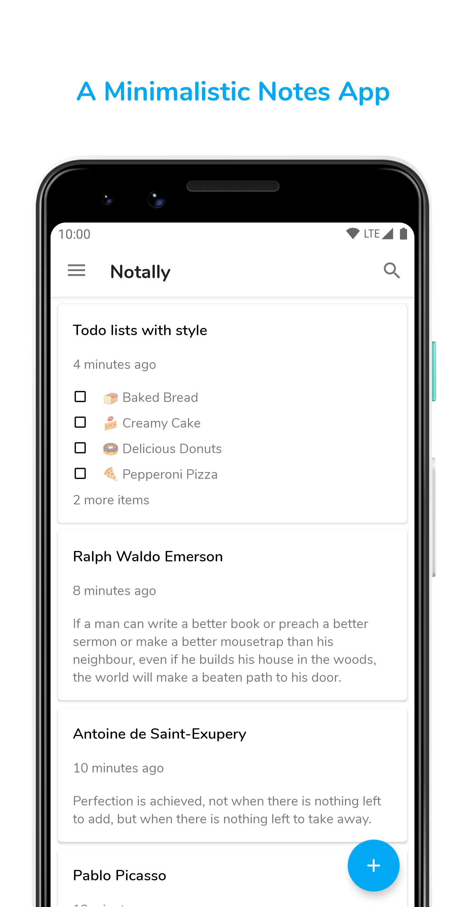

# Notally
A minimalistic notes app

* Auto save
* Dark mode
* Material design
* Create lists to stay on track
* Add labels to your notes for quick organisation
* Archive notes to keep them around, but out of your way
* Export notes as plain text, HTML or PDF files with formatting
* Create rich text notes with support for bold, italics, mono space and strike-through

Languages

* English
* Italian by Luigi Sforza
* Ukrainian by Alex Shpak
* French by Arnaud Dieumegard

If you would like to help translate the app, please contact me [here](mailto:omgodseapps@gmail.com)

# Download

# Screenshots

