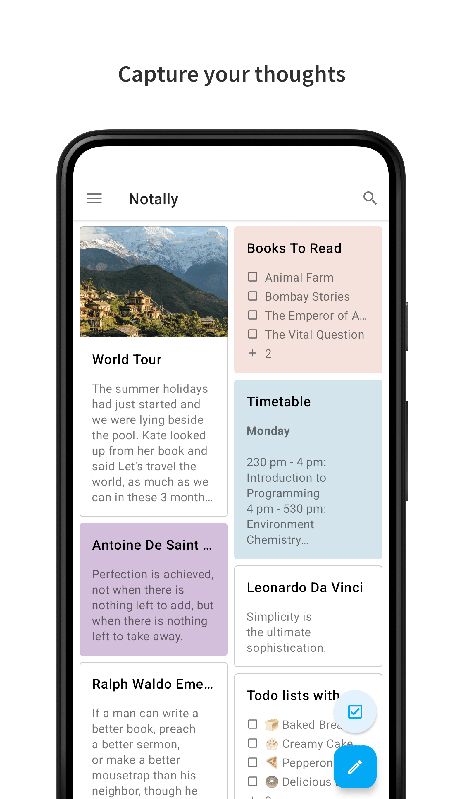
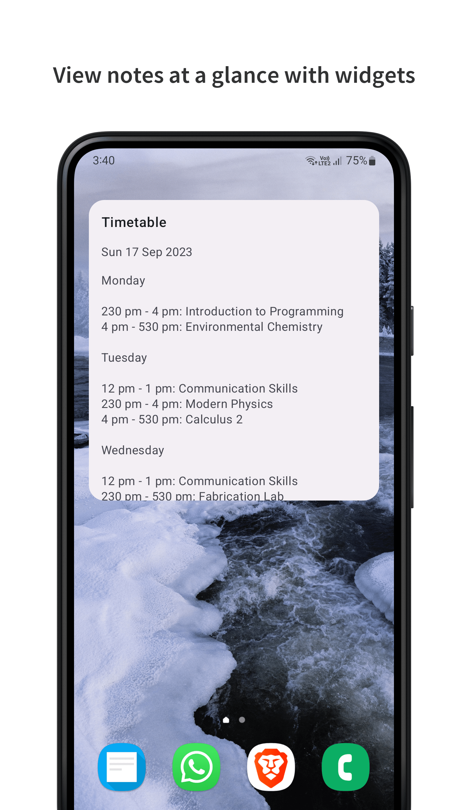

### Background
Notally was created because I wanted to make something that was beautiful and at the same time, useful. It's extremely light, there are minimal dependencies and lines of code.

### Features
* Auto backup
* Adjustable text size
* Support for Lollipop devices and up
* APK size of 1.2 MB (1.6 MB uncompressed)
* Color, pin and label your notes for quick organisation
* Archive notes to keep them around, but out of your way
* Export notes as TXT, JSON, HTML or PDF files with formatting
* Create rich text notes with support for bold, italics, mono space and strike-through
* Add clickable links to notes with support for phone numbers, email addresses and web urls

### Translations
All translations are crowd sourced. To contribute, follow these [guidelines](https://m2.material.io/design/communication/writing.html) and email me or open a pull request.

### Hall of fame
* [Top 20 Android Apps 2021!](https://www.youtube.com/watch?v=bwz13aM0qJk)
* [De-Googling Any Android Phone! (Google Apps Alternatives)](https://www.youtube.com/watch?v=RQUEgwgV99I)
* [The BEST Private Notetaking Apps Explained](https://www.youtube.com/watch?v=BJw5tKPP1PY)
* [Notally](https://www.noteapps.ca/notally/)

### Copycats
Clones of Notally keep popping up on the Play Store. They are not licensed under GPL3 and usually change a few colors, include ads, etc. Please [report them](https://support.google.com/googleplay/android-developer/contact/takedown) and [inform me](mailto:omgodseapps@gmail.com) if you find a new one.

* https://play.google.com/store/apps/details?id=com.sladjan.notes
* https://play.google.com/store/apps/details?id=com.sladjan.notespro

### Roadmap
These are in works but they'll take time as this is a side project.
- [ ] Images
- [ ] Widgets
- [ ] Batch selection