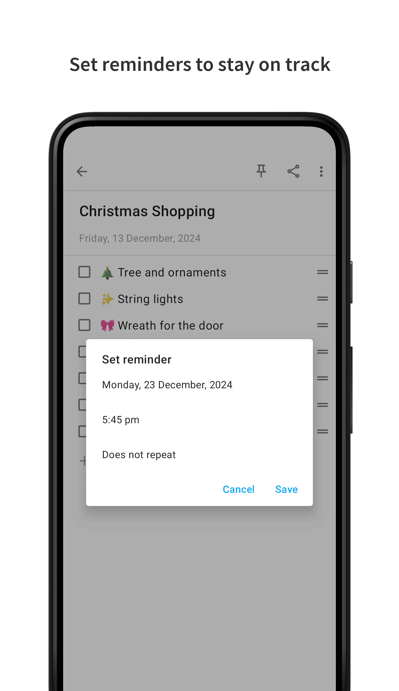

### Background
Notally was created because I wanted to make something that was beautiful and at the same time, useful. It's extremely light, there are minimal dependencies and lines of code. (All without compromising on readability)

### Features
* Auto save
* No permissions required
* Support for Lollipop devices and up
* Label your notes for quick organisation
* Pin notes to always keep them at the top
* APK size of 1.3 MB (1.7 MB uncompressed)
* Archive notes to keep them around, but out of your way
* Export notes as TXT, XML, JSON, HTML or PDF files with formatting
* Create rich text notes with support for bold, italics, mono space and strike-through
* Add clickable links to notes with support for phone numbers, email addresses and web urls

### Translations
All translations are crowd sourced. To contribute or point out any errors, please email me or open a pull request.

